<div align="center">

# 🚗 Automotive ECU Network Simulation via CAN Bus

**A deeply integrated multi-node system simulating real-world vehicular Electronic Control Units (ECUs) using STM32 microcontrollers, advanced peripheral configurations, and the CAN 2.0 protocol.**

[](#)
[](#)
[](#)
[](#)

</div>

---

## 📋 Project Overview & Architecture

In modern automotive engineering, centralized processing is replaced by distributed **Electronic Control Units (ECUs)** communicating over a robust **Controller Area Network (CAN)**. 

This project meticulously replicates a car's internal network using 4 STM32F103C8T6 nodes. Each ECU independently handles its specific hardware layer (Sensors/Actuators via I2C, SPI, Timers) and shares multiplexed data across the CAN bus to a Main Dashboard ECU.

<p align="center">
  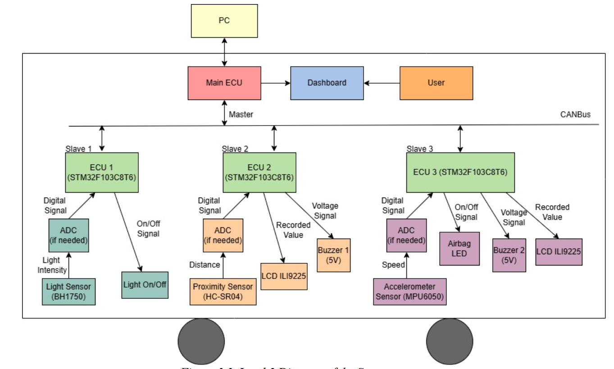
  <br><em>Level 2 System Diagram: Multi-master CAN network architecture</em>
</p>

---

## 🔬 Detailed ECU Design & Configurations

Every ECU in this project was individually designed, pin-mapped, and configured using **STM32CubeMX**, relying on hardware interrupts and DMA to ensure non-blocking, real-time automotive performance.

### 💡 ECU 1: Intelligent Light Control (Auto Headlights)
**Role:** Simulates automatic headlights that adapt to ambient lighting conditions.
*   **Sensor:** BH1750 Ambient Light Sensor (via I2C).
*   **Logic:** Reads Lux values. If the value drops below a safety threshold (e.g., entering a tunnel), it drives an LED HIGH and broadcasts a state-change message to the Main ECU.

<p align="center">
  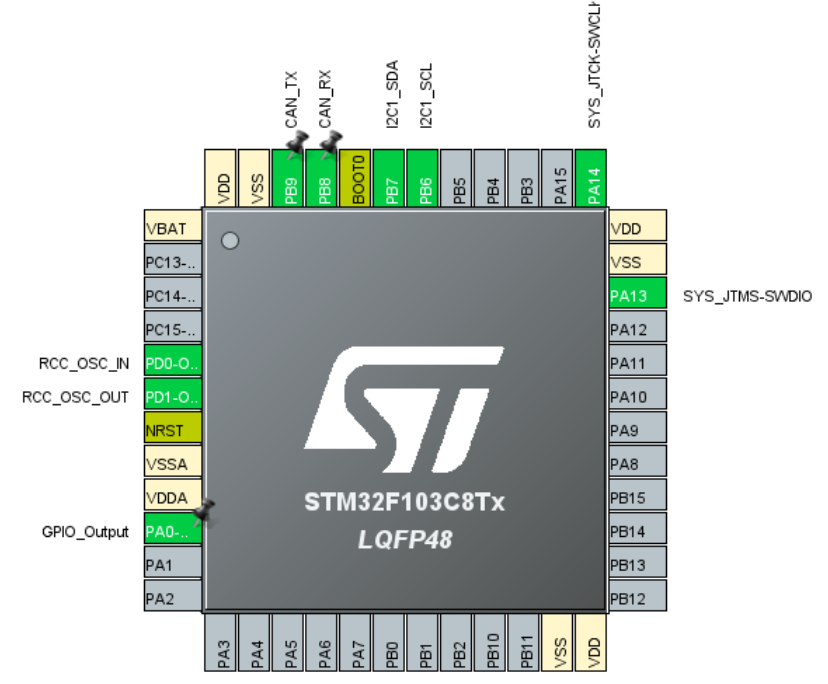 &nbsp;
  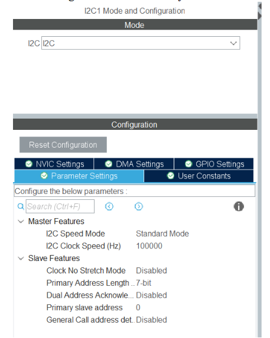
</p>

### 🅿️ ECU 2: Parking Assistance System (PAS)
**Role:** Detects rear obstacles during parking and provides auditory feedback.
*   **Sensor:** HC-SR04 Ultrasonic Sensor (via `TIM1` Input Capture).
*   **Logic:** Uses Timer to calculate microsecond echo pulse width into distance. Controls a PWM Buzzer with dynamic frequencies depending on proximity. 
*   **CAN Output:** Broadcasts status payloads (`SAFE`, `SLOW`, `STOP`) over the CAN bus.

<p align="center">
  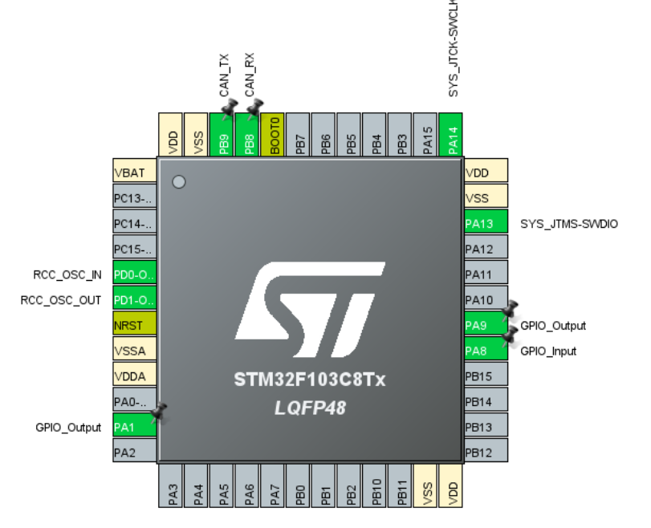 &nbsp;
  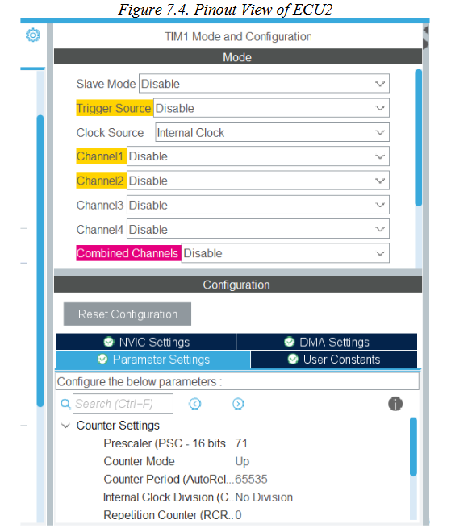 &nbsp;
  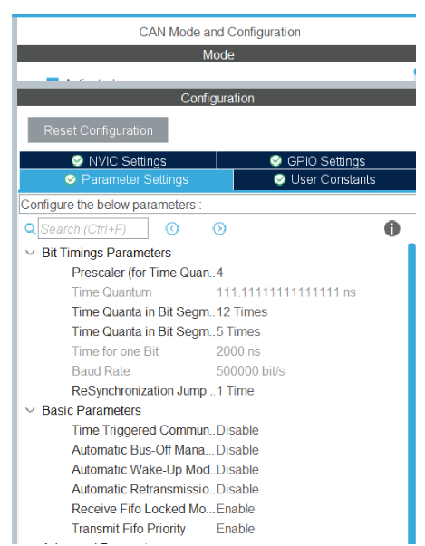
</p>

### 💥 ECU 3: Crash Detection & Airbag Deployment
**Role:** Critical safety node for collision detection.
*   **Sensor:** MPU6050 3-axis Accelerometer (via I2C).
*   **Logic:** Continuously polls acceleration vectors. Applies an `IMPACT_THRESHOLD` algorithm to detect sudden deceleration (crash). 
*   **CAN Output:** Upon crash detection, triggers the Airbag deployment LED and immediately sends a high-priority `CRASH` interrupt message to stop the vehicle system.

<p align="center">
  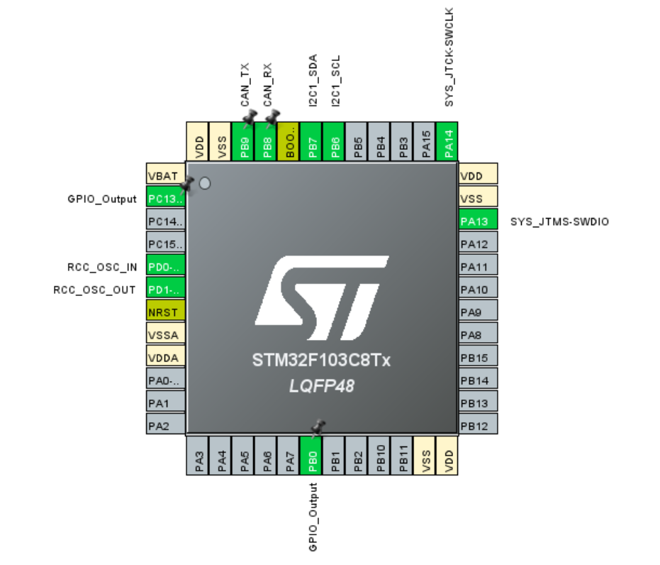 &nbsp;
  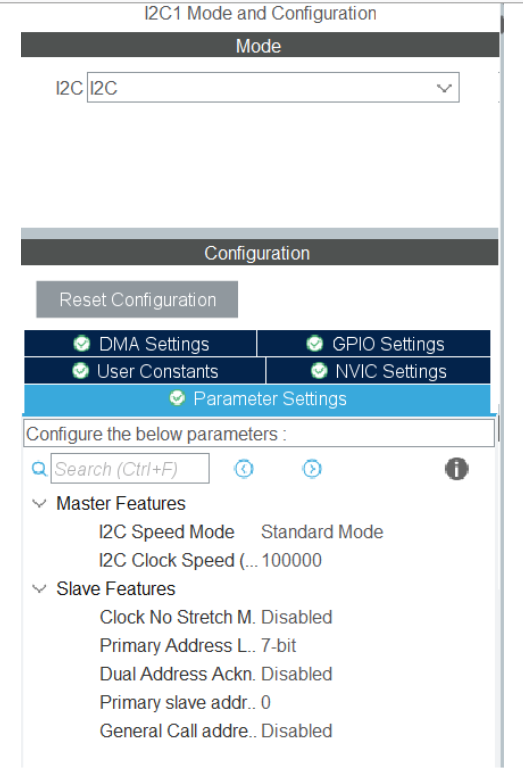
</p>

### 🎛️ Main ECU: Central Dashboard Controller
**Role:** Acts as the central hub, processing network traffic and displaying UI.
*   **Hardware:** ILI9225 LCD Screen (via High-Speed SPI).
*   **Logic:** Implements `HAL_CAN_RxFifo0MsgPendingCallback`. Uses hardware CAN Filters with specific Mask IDs to accept messages only from ECU 1, 2, and 3. Updates the graphical dashboard instantly based on the received payloads.

<p align="center">
  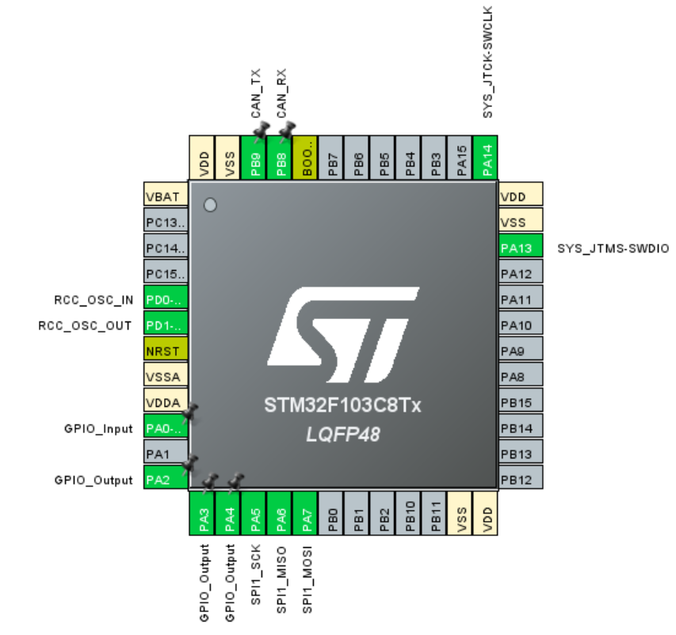 &nbsp;
  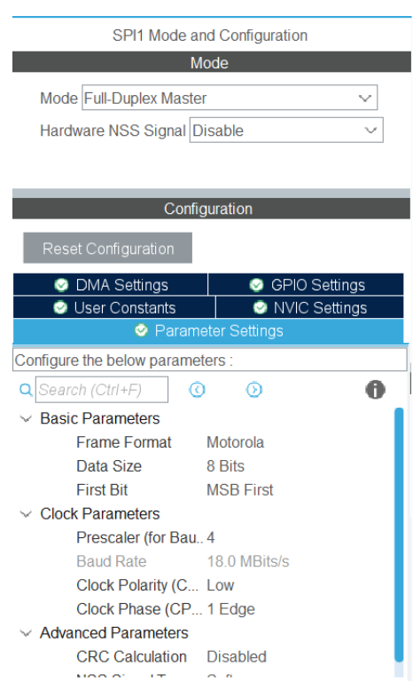
</p>

---

## 🌐 CAN Bus Communication Protocol

To prevent packet collision and ensure data integrity, the CAN network operates at **500 kbit/s** with meticulously configured Time Quanta. Message identifiers (IDs) were assigned hierarchically:

| Transmitter | Receiver | CAN ID (Hex) | Payload Example |
| :--- | :--- | :---: | :--- |
| ECU 1 (Light) | Main ECU | `0x101` | `0x01` (Toggle), `0x02` (Mode Switch) |
| ECU 2 (Parking) | Main ECU | `0x202` | `"SAFE"`, `"SLOW"`, `"STOP"` |
| ECU 3 (Airbag) | Main ECU | `0x404` | `"CRASH"` |
| Main ECU | ECU 1 | `0x303` | Status request / Override commands |

*CAN Filters were configured using `CAN_FILTERMODE_IDMASK` to isolate network traffic effectively.*

---

## 🛠️ Physical Hardware Implementation

<p align="center">
  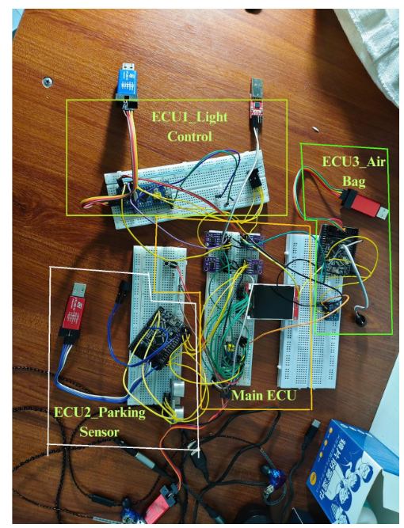
  <br><em>Physical implementation of the 4 nodes, interconnected via TJA1050 CAN Transceivers.</em>
</p>

---

## 🧪 System Testing & Validation

A rigorous test plan was executed to ensure real-time latency and reliability. All ECUs functioned as expected without CAN bus errors.

| ECU Node | Test Case | Expected Result | Actual Result |
| :--- | :--- | :--- | :---: |
| **ECU 2 (Parking)** | Distance > 100cm | Buzzer OFF, CAN message: `SAFE` | ✅ Pass |
| **ECU 2 (Parking)** | Distance 50-100cm | Buzzer slow beep, CAN message: `SLOW` | ✅ Pass |
| **ECU 2 (Parking)** | Distance < 10cm | Buzzer fast beep, CAN message: `STOP` | ✅ Pass |
| **ECU 1 (Light)** | No ambient light | Headlight LED turns `ON` | ✅ Pass |
| **ECU 3 (Airbag)** | Sudden collision detected | Airbag LED `ON`, CAN message: `CRASH` | ✅ Pass |
| **Main ECU** | Receive `CRASH` message | UI displays: **CRASH DETECTED** immediately | ✅ Pass |

---

## 📂 Repository Structure

The source code is organized into 4 separate STM32CubeIDE projects for modularity:

```text
📦 Automotive-ECU-CAN-Simulation
 ┣ 📂 src
 ┃ ┣ 📂 ECU1_Intelligent_Light       # BH1750 + CAN
 ┃ ┣ 📂 ECU2_Proximity_Warning       # HC-SR04 + TIM1 + CAN
 ┃ ┣ 📂 ECU3_Airbag_Crash_Sensor     # MPU6050 + CAN
 ┃ ┗ 📂 ECU_Main_Dashboard           # CAN Rx Filters + SPI ILI9225 LCD
 ┣ 📂 images                         # Pinouts, configs, and hardware
 ┗ 📜 README.md
